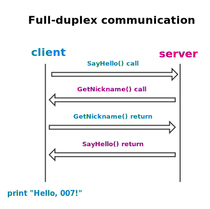

# Sample



## Source

- [services.proto](./services.proto)
- [server/main.go](./server/main.go)
- [client/main.go](./client/main.go)

## Startup

1. compile `services.proto` to  [services.pb.go](./services.pb.go) and [services.pbrpc.go](./services.pbrpc.go) (RPC stub)

   ```bash
   GOPATH=${GOPATH:-$(go env GOPATH)}
   protoc --proto_path="${GOPATH}/src" --gogofaster_out="${GOPATH}/src" --pbrpc_out="${GOPATH}/src" -I. services.proto
   ```

2. run rpc server

   ```bash
   go run server/main.go
   ```

3. run rpc client

   ```bash
   go run client/main.go
   # output: Hello, 007!
   ```
